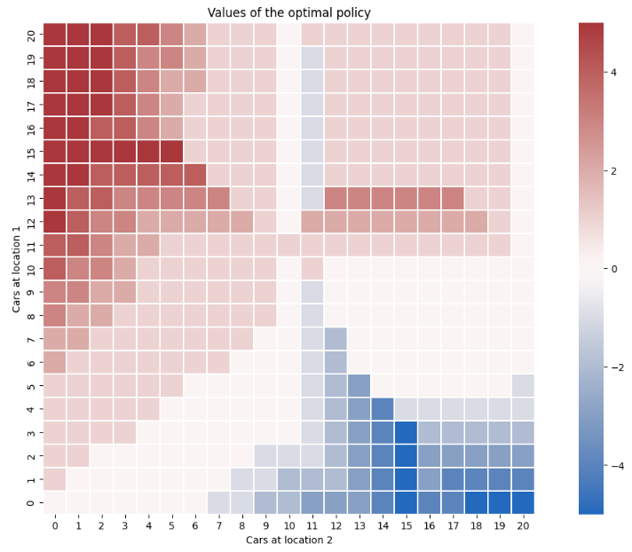

# Kairo's Car Rental 

This repository implements a solution to the Kairo's Car Rental problem using **Markov Decision Processes (MDP)** and the **Policy Iteration** algorithm. The goal is to optimize car movements between two rental locations to maximize profit while minimizing operational costs.

## Problem Description

Kairo manages two car rental locations in Kenya. Each day:
- Customers arrive at each location to rent cars.
- Rentals generate a revenue of **$ 10 per car**.
- Cars can be moved between locations overnight at a cost of **$ 2 per car**.
- Keeping more than 10 cars overnight at a single location incurs an additional parking cost of **$ 4**.

The demand for rentals and returns at each location follows a **Poisson distribution**

The objective is to find the **optimal policy** for moving cars between the two locations to maximize long-term profit, with a **discount rate γ  of 0.9**. 

## Features
- **Policy Iteration**:
  - Evaluate the current policy and improve it iteratively until convergence.
- **Poisson Distribution Modeling**:
  - Efficient computation of rental and return probabilities.
- **Cost and Reward Modeling**:
  - Accounts for revenues, moving costs, and parking penalties.

## Results

### Optimal Policy Heatmap
The **Optimal Policy Heatmap** visualizes the recommended number of cars to move between Location A and Location B overnight, based on the current state (number of cars at each location):

- **X-Axis**: Number of cars at Location B.
- **Y-Axis**: Number of cars at Location A.
- **Heatmap Values**: 
  - Positive values (red regions) indicate cars should be moved from Location A to Location B.
  - Negative values (blue regions) indicate cars should be moved from Location B to Location A.
  - Zero (white) indicates no movement is needed.

Below is the resulting heatmap from the optimal policy calculation:

### Key Observations
- **Red regions**: When Location A has excess cars, the optimal policy recommends moving them to Location B to meet demand.
- **Blue regions**: When Location B has excess cars, the optimal policy recommends moving them to Location A.
- The central **white diagonal** indicates balanced scenarios where no car movement is needed.
- Movement is kept to a minimum to reduce transportation costs unless necessary for meeting rental demand or avoiding parking penalties.

